# UML Diagrams – Finance Tracker

Phiên bản: 1.0  
Ngày: 2025-10-29

Tài liệu này chứa các sơ đồ UML cho hệ thống Finance Tracker, sử dụng định dạng Mermaid.

> **Lưu ý**: Các sơ đồ dưới đây dùng Mermaid syntax, xem tốt nhất trên GitHub, VS Code với extension Markdown Preview Enhanced, hoặc các công cụ hỗ trợ Mermaid khác.

## 1. Use Case Diagram – Quản lý tài chính cá nhân

Biểu đồ use case mô tả các chức năng chính mà người dùng có thể thực hiện với hệ thống.

```mermaid
usecaseDiagram
    actor User as "Người dùng"
    rectangle "Finance Tracker" {
        (Đăng ký/Đăng nhập)
        (Đăng nhập Google)
        (Quản lý ví)
        (Quản lý danh mục)
        (Ghi chép giao dịch)
        (Phân bổ ngân sách)
        (Xem phân tích)
    }
    User -->(Đăng ký/Đăng nhập)
    User -->(Đăng nhập Google)
    User -->(Quản lý ví)
    User -->(Quản lý danh mục)
    User -->(Ghi chép giao dịch)
    User -->(Phân bổ ngân sách)
    User -->(Xem phân tích)
```

## 2. Activity Diagram – Thêm giao dịch và cập nhật số dư ví

Sơ đồ hoạt động mô tả luồng xử lý khi người dùng thêm một giao dịch mới và hệ thống tự động cập nhật số dư ví.

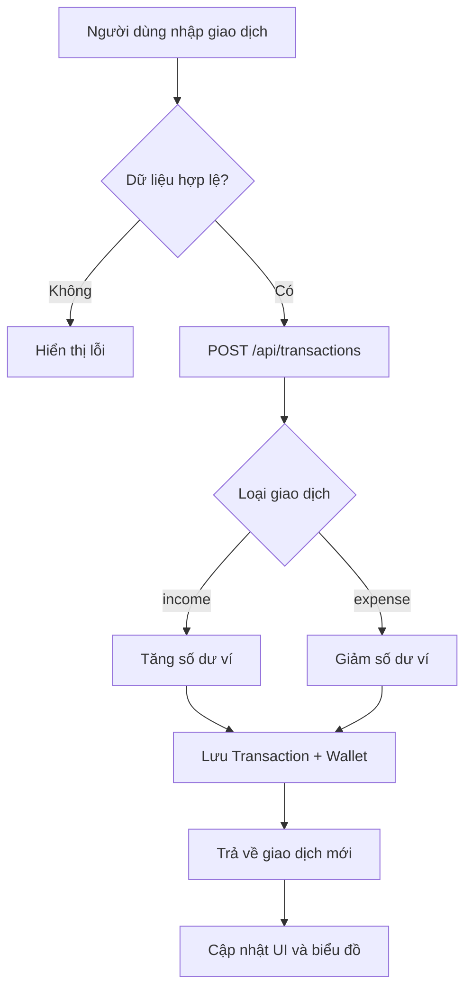

## 3. Sequence Diagram – Tạo giao dịch

Biểu đồ trình tự mô tả tương tác giữa các thành phần khi tạo một giao dịch mới.

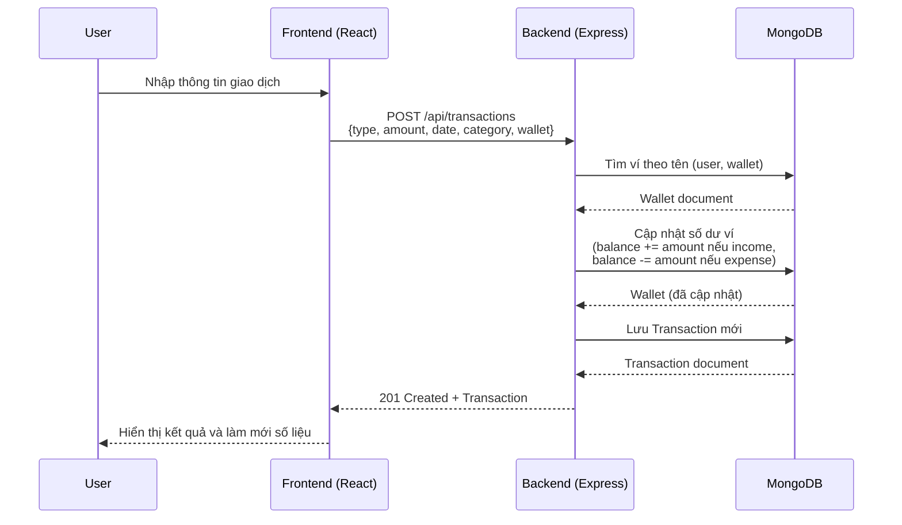

## 4. Class Diagram – Mô hình dữ liệu chính

Biểu đồ lớp mô tả cấu trúc dữ liệu và quan hệ giữa các entity trong hệ thống.

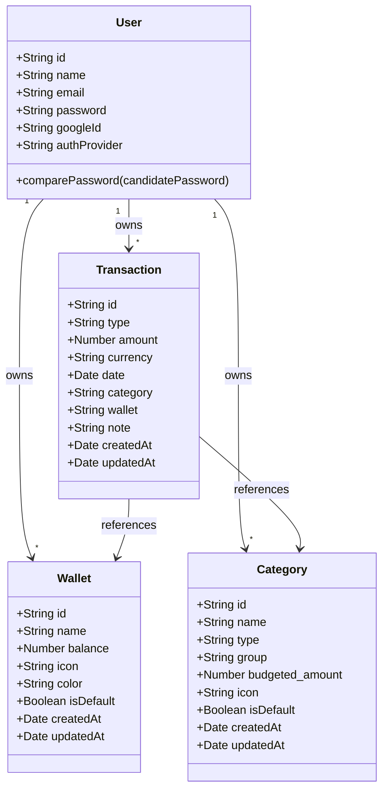

## 5. Component Diagram – Kiến trúc tổng thể

Sơ đồ thành phần mô tả cấu trúc tổng thể của hệ thống, phân chia các module chính.

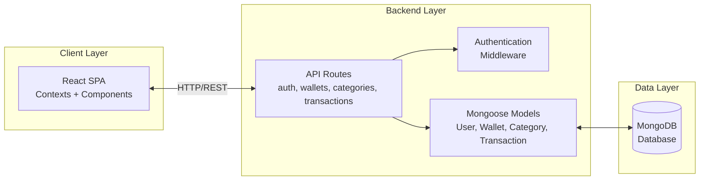

## 6. Deployment Diagram – Kiến trúc triển khai

Biểu đồ triển khai mô tả cách hệ thống được triển khai trên các môi trường.

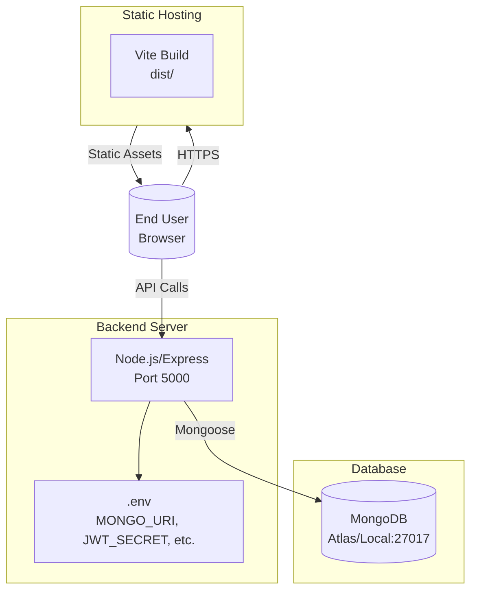

## 7. State Diagram – Onboarding Flow

Biểu đồ trạng thái mô tả các trạng thái trong quy trình onboarding của người dùng mới.

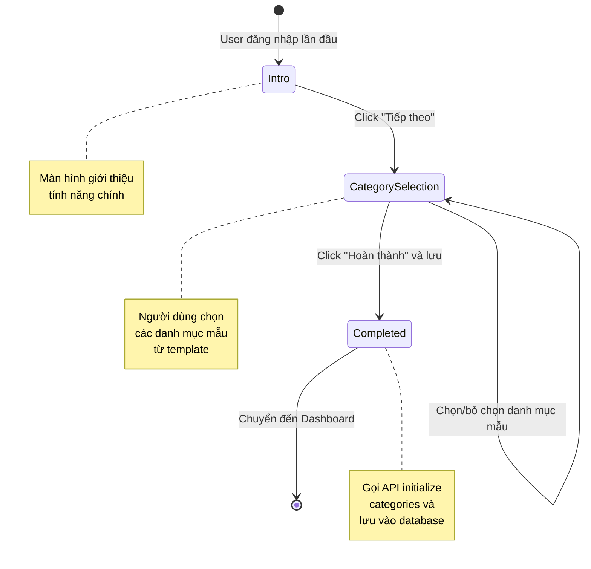

## 8. ERD (Entity Relationship Diagram) – Quan hệ dữ liệu

Sơ đồ quan hệ thực thể mô tả chi tiết các bảng và mối quan hệ trong database.

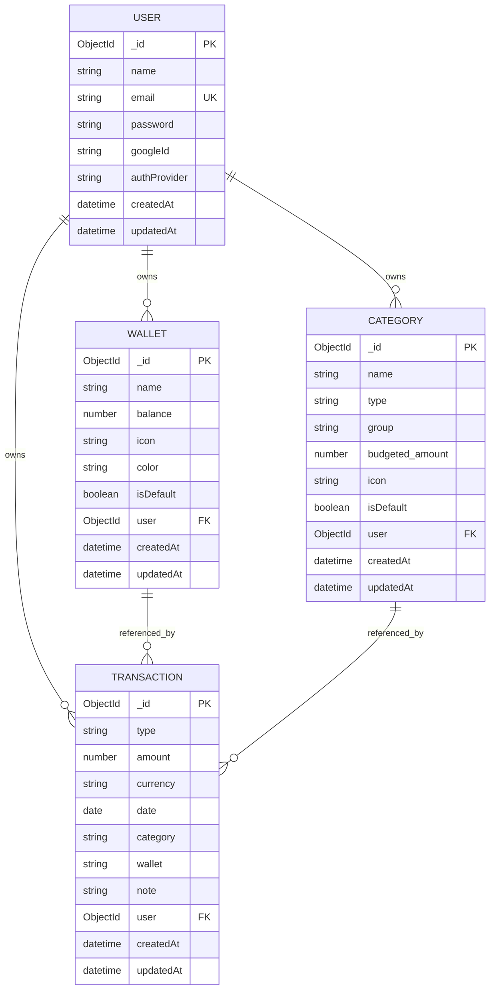

### 8.1 ERD Chuẩn hóa (Đề xuất – tham chiếu bằng ObjectId)

Phiên bản đề xuất giúp đảm bảo toàn vẹn tham chiếu (Transaction trỏ đến `walletId`, `categoryId` thay vì tên chuỗi).

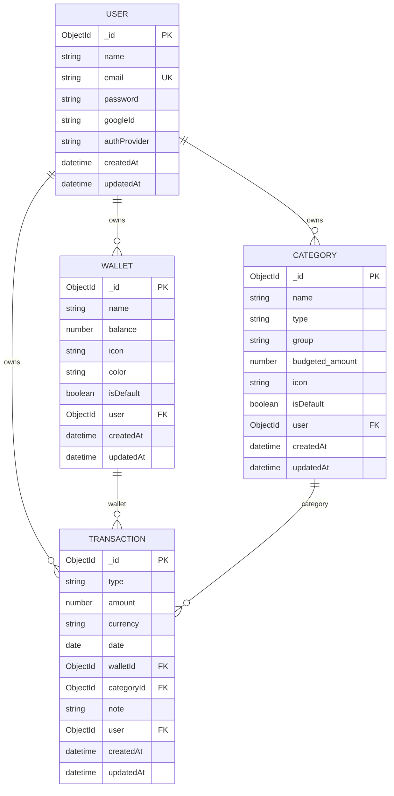

### 8.2 ERD Star Schema (Báo cáo/Phân tích)

Mô hình ngôi sao đề xuất cho nhu cầu phân tích: một fact tổng hợp tham chiếu các dimension.

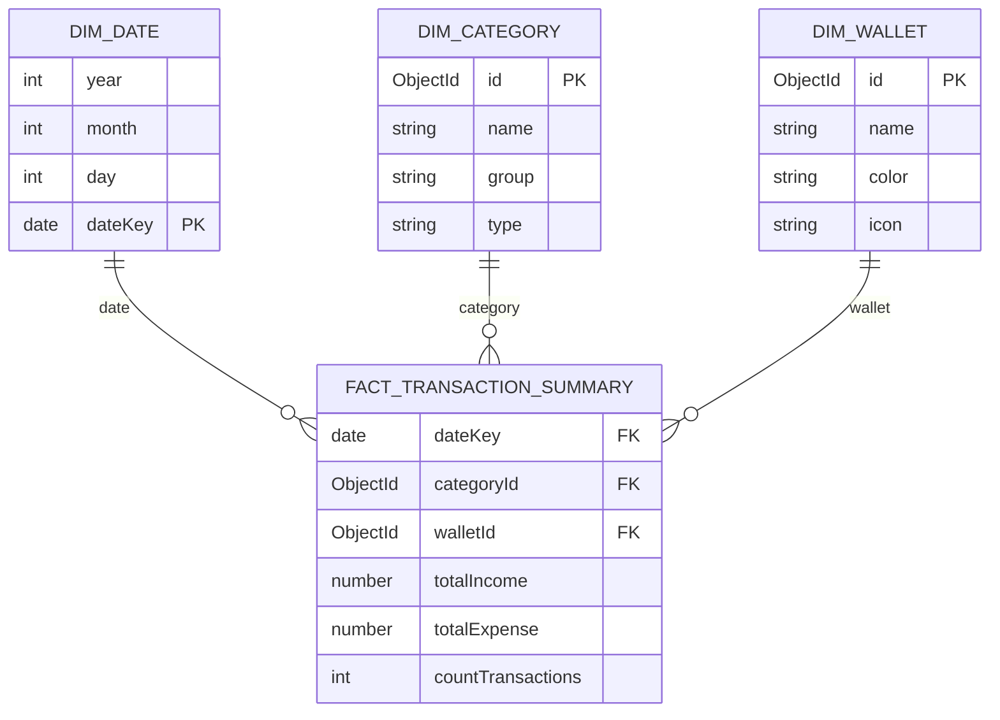

### 8.3 Gợi ý chỉ mục (Indexes) cho hiệu năng

- TRANSACTION: `(user, date DESC)`, `(user, type)`, `(user, category, date DESC)`
- CATEGORY: `(user, name)`
- WALLET: `(user, name)`

## 9. Data Flow Diagram – Luồng dữ liệu phân bổ ngân sách

Sơ đồ luồng dữ liệu mô tả quy trình phân bổ ngân sách theo phương pháp Zero-Based Budgeting.

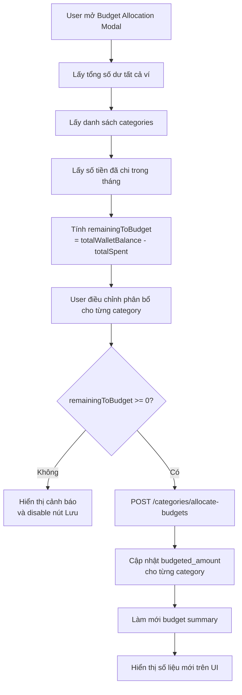

## 10. Central “+” Action – Wallet check then Add Transaction

Mô tả hành vi nút hành động trung tâm ở bottom navigation.

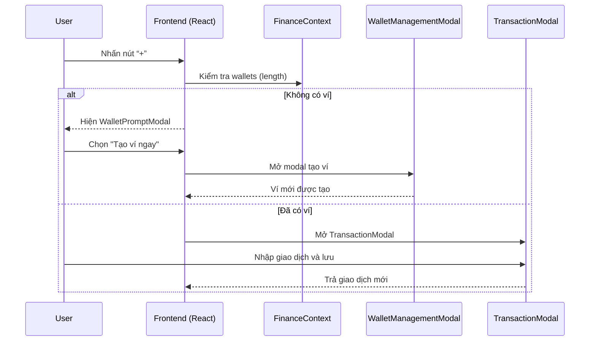

## Ghi chú

- Tất cả các sơ đồ sử dụng định dạng Mermaid và có thể render trực tiếp trên các platform hỗ trợ.
- Các sơ đồ này phản ánh trạng thái hiện tại của hệ thống và có thể cần cập nhật khi có thay đổi về kiến trúc hoặc tính năng.
- Để xem các sơ đồ này:
  - Trên GitHub: tự động render khi xem file `.md`
  - VS Code: cài extension "Markdown Preview Enhanced" hoặc "Markdown Preview Mermaid Support"
  - Online: https://mermaid.live/
